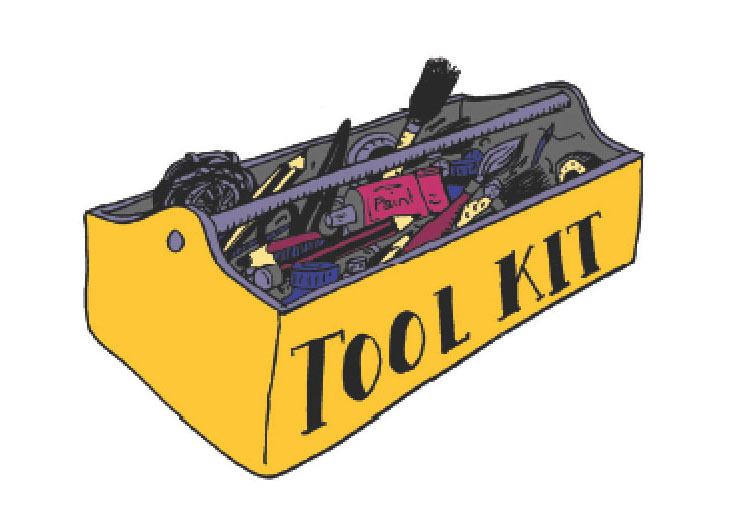
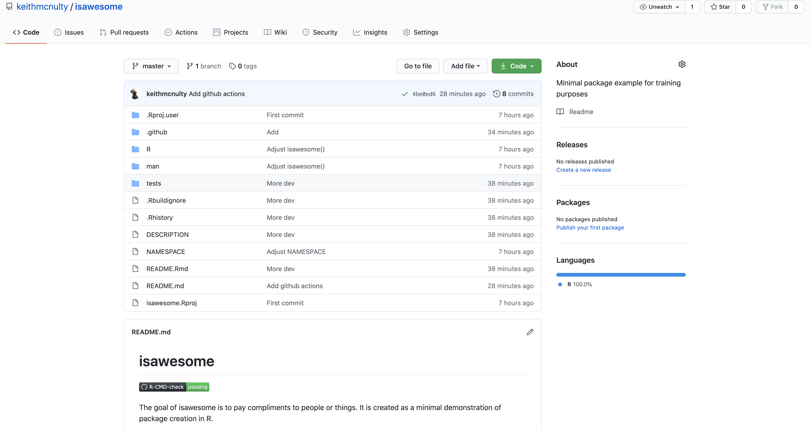
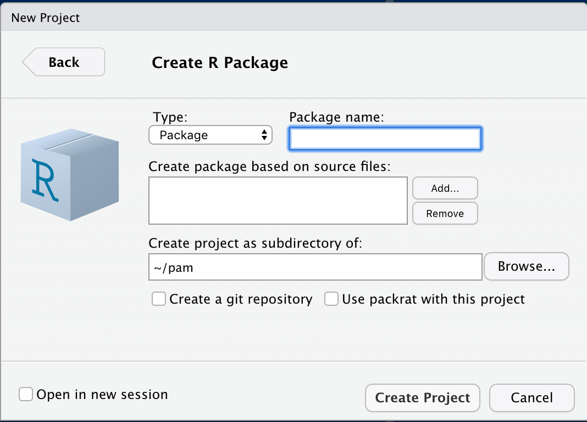
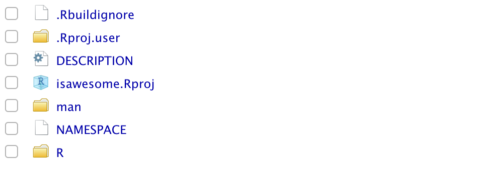
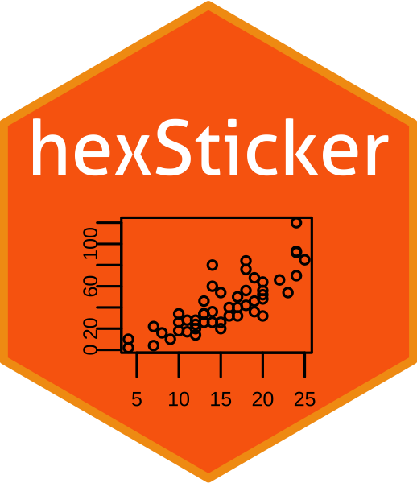
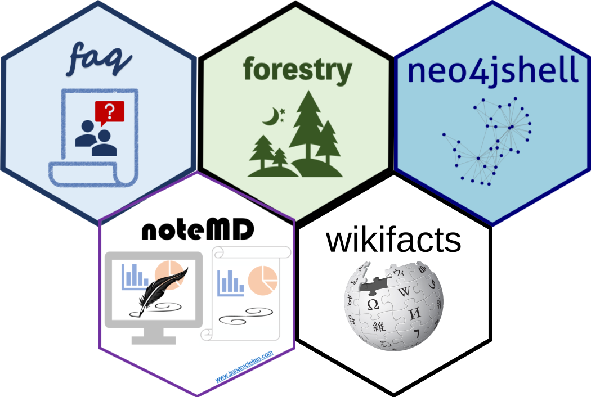

```{r setup, include=FALSE}
options(htmltools.dir.version = FALSE)
```

class: center, middle, r-logo

# Welcome to the R Community


---
class: center, middle, r-logo

# Why R Packages?

### A simple way to distribute R code and documentation


--
### An easier way to keep track of R functions that you write and reuse


--
### A great way to help other R users


--
### *"If you will do it more than once, write a function.  If more than you will do it more than once, develop a package"* - Some clever person

---
class: left, top, r-logo

## Examples

```{r out.width='100%', fig.height = 4, eval = require('faq')}
library(faq)
df <- data.frame(
  question = c("Question1", "Question2"),
  answer = c("answer for question1", 
             "question2 answer")
)
faq::faq(data = df, elementId = "faq", faqtitle = "")
```

---
class: left, top, r-logo

## Important resources for package creation

<p style="text-align:center;">

</p>

* The package bible: [R Packages by Hadley Wickham](http://r-pkgs.had.co.nz/)
* The `devtools` package for managing the package development workflow
* The `usethis` package to make it easier to use things in your development workflow
* The `testthat` package for unit testing your functions (optional, but highly recommended)

---
class: left, top, r-logo

## We've created a minimal package example on Github to demonstrate


https://github.com/keithmcnulty/isawesome

```r
devtools::install_github("keithmcnulty/isawesome")
```

---
class: center, middle, r-logo

# Get Started


---

class: center, middle, r-logo

# Step a): Set up package project

Install the **devtools** package



---

class: left, top, r-logo

## Minimal project infrastructure




* `DESCRIPTION` lists package details, description, authors, dependencies
* `NAMESPACE` is used for listing which functions are exported versus hidden, and also imported functions from other packages
* `R` directory is where code for package functions is written
* `man` is for help files - usually automatically generated.

---
class: left, top, r-logo

## Example `DESCRIPTION` file

```
Package: isawesome
Type: Package
Title: Tells people they are awesome
Version: 0.1.0
Author: c(
  person(given = "Jiena",
         family = "McLellan",
         role = c("aut", "cre"),
         email = "jienagu90@gmail.com")
  person(given = "Keith",
         family = "McNulty",
         role = c("ctb"),
         email = "keith.mcnulty@gmail.com"))
Maintainer: Jiena McLellan <jienagu90@gmail.com>
Description: This package creates functions which pay you compliments.  
  It is created as a minimal example for a training on R package creation.
License: CC0
Imports:
  magrittr
Encoding: UTF-8
LazyData: true
RoxygenNote: 7.1.1
```

---
class: left, top, r-logo

## Example `NAMESPACE` file

```
exportPattern("^[:a-z:]+") # any function whose name starts with a-z
importFrom("magrittr", "%>%") # import the pipe operator from magrittr
```


---

class: center, middle, r-logo

# Step b): Write functions

### Give a function an evocative name that makes your code easier to understand

--
### As requirements change, you only need to update code

--
### Eliminate the chance of making incidental mistakes when you copy and paste


---
class: left, top, r-logo

## Example exported function

```{r, eval = FALSE}
# this function will be exported

isawesome <- function(name = "Someone", alternative = FALSE, 
                      return_message = TRUE) {
  if (!alternative) {
    if (return_message) {
      paste(name, "is awesome!") %>%
        message()
    } else {
      paste(name, "is awesome!")
    }
  } else {
    if (return_message) {
      paste(name, .random_compliment()) %>%
        message()
    } else {
      paste(name, .random_compliment())
    }
  }
}
```

---
class: left, top, r-logo

## Example internal function

```{r, eval = FALSE}
# this function is internal

.random_compliment <- function() {
  sample(c("is incredible!", "is amazing!", "rocks!"), 1)
}
```

---

class: center, middle, r-logo

# Step c): Document

### Use `roxygen` commenting above exported function 

--

### Write comments as you code

--
### Include a README file with basic information

--

### Use vignettes for more substantial guidance

--
### Write error messages that provide solutions 


---
class: left, top, r-logo

## Example `roxygen` commenting

```{roxygen}
#' Gives compliments
#'
#' @description
#' Displays a message that compliments the input.
#'
#' @param name A character string of the person or object to be complimented
#' @param alternative A logical indicating whether alternatives to 'is awesome' should be used
#' @param return_message A logical indicating whether a message should be returned.  If FALSE a character string will be returned.
#' @return A message that pays a compliment.
#'
#' @examples
#' isawesome("Randy 'Macho Man' Savage")
#' isawesome("Hulk Hogan", alternative = TRUE)
```

* Running `devtools::document()` will turn these into manual pages (in `man` folder)
* Examples will be run during package check - they need to work
* For CRAN submission examples need to run in less than 5s

---
class: left, top, r-logo

## Creating a `README` or vignettes

* `README.md` is useful for general overview of what's in the package
* vignettes can be used to demonstrate the functionality in details
* `usethis::use_readme_rmd()` creates an RMarkdown where you can create your readme and knit it to `README.md`
* `usethis::use_vignette(name)` sets up RMarkdown documentation for vignette with name provided

---
class: center, middle, r-logo

# Step d): Unit test

### Time consuming but product saving

--
### Any Bugs Are Found Easily and Quicker

---
class: left, top, r-logo

## Example: test file

* `usethis::use_testthat()` sets up testing in your package
* `usethis::use_test("isawesome")` creates `test-isawesome.R`

```{r, eval = FALSE}
string <- stringi::stri_rand_strings(n = 1, length = sample(1:20, 1), pattern = "[A-Za-z0-9]")

test_that("isawesome() produces the expected output", {
  isawesome(string, return_message = FALSE) %>%
    testthat::expect_equal(paste(string, "is awesome!"))
})
```

---
class: center, middle, r-logo

# Step e): Build and check

### Check package builds OK (incl documentation and tests)

--

### Integrated build checks on Github using Github Actions (CI)

--

### Windows OS testing via CRAN servers

---
class: left, top, r-logo

## Useful build and check tools

* `devtools::check()` performs check on your system
* `usethis::use_github_actions()` will set up for CI R-CMD check in (public) Github for Unix-based systems
* `devtools::check_win_release()` tests the package on CRAN's Window's servers (emails test results).  
* CAUTION:  The last two are not suitable for packages containing confidential material.

---
class: center, middle, r-logo
# Step f): Submit to CRAN

### Any package can go on CRAN if it works and is not dangerous 

--

### Aim for 0 ERRORS, 0 WARNINGS, 0 NOTES (last one not always possible)

--

### Think about version numbering (usually start with 0.1.0)

--

### New packages will always be manually checked (5-10 working days)

--

### Updates are often immediately approved

---
class: left, top, r-logo

##  CRAN Submission process

1.  Use `devtools::release()` to do all checks and submit to CRAN.
2.  Respond to the email to confirm submission.
3.  Wait to see if it is auto-approved (only for package updates)
4.  If manually checked, wait to hear from CRAN team.
5.  Use `cran-comments.md` file to communicate with CRAN team if changes needed.
6.  Some fixes are really tiny, like punctuation and capitalization rules.
7.  Try to avoid debating with the CRAN team - just make the fix.
8.  Congrats - you are on CRAN!
9.  Tweet and blog about your package to let people know!
10. If you are feeling creative, use the `hexSticker` package to create a hex sticker for your package

---
class: middle, r-logo

## Create hex logo

* Use template: https://emitanaka.org/post/hexsticker/
* Use `hexSticker` package

```{r, eval = FALSE}
library(hexSticker)
s <- sticker(~plot(cars, cex=.5, cex.axis=.5, mgp=c(0,.3,0), xlab="", ylab=""),
             package="hexSticker", p_size=8, s_x=.8, s_y=.6, s_width=1.4, s_height=1.2,
             h_fill="#f9690e", h_color="#f39c12",
             filename="baseplot.png")
```




---
class: center, middle, r-logo

# Thank you and happy package building




